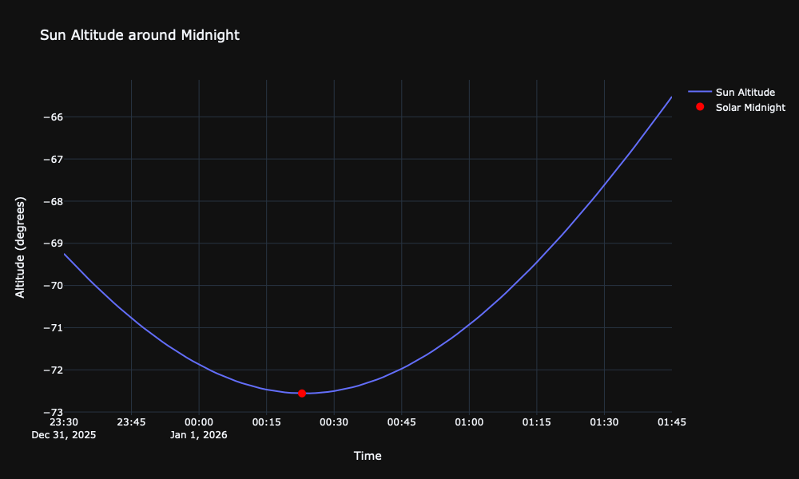

# Solar New Year
_Why be close, when you can be exact?_

New year count downs usually lead to midnight on the first of January.
Midnight, of course, is an arbitrary construct - maybe we should count down to true solar midnight instead?
The goal then becomes calculating when solar midnight will occur, and to convince all your friends to countdown to that time instead. I will focus on the former and leave the latter to you.

## Solar Midnight
According to [Wikipedia](https://en.wikipedia.org/wiki/Midnight), solar midnight happens halfway between sunset and sunrise, when the sun is closest to [nadir](https://en.wikipedia.org/wiki/Nadir) (down).


Unfortunately, it's hard to observe the position of the sun at night directly. With clear days around the end of December and periodic sextant measurements of the position of the sun around noon, you could come up with a pretty good estimate though: 12 hours after when the sun is highest on the sky.

Thankfully for us, it's also possible to make predictions with a python library called [astropy](https://www.astropy.org)!

## Astropy
I've played around with astropy a little bit for various projects, but found this was a pretty easy routine to come up with (especially since AI did most of it).
Behind the scenes, astropy pulls astronomical ephemeris data from a few sources like [this one](https://naif.jpl.nasa.gov/pub/naif/generic_kernels/spk/planets/). That data contains historical and prediction position information about objects in the solar system.

We can use this to find the exact time when the sun is lowest in the sky at our new years party. Of course this is all location dependent, so start with that.
```python
import astropy.coordinates as ac
location = ac.EarthLocation(
    lat=..., lon=..., height=0)
```

Then we need a rough guess for when solar midnight will occur - normal midnight will do for this. 
```python
import astropy.time as at
tz = ZoneInfo("America/New_York")
start = datetime(2025, 1, 1, 23, 30, tzinfo=tz)
end = datetime(2026, 1, 1, 0, 30, tzinfo=tz)
```


Next, we need a function to query the position of the sun at a given sample time.
This converts the 3D position of the sun into an [AltAz](https://docs.astropy.org/en/stable/api/astropy.coordinates.AltAz.html) - an altitude and azimuth on the sky at the given location. The sun will generally be at some negative altitude during the night.
```python
def solar_altitude_at(time):
    time = at.Time(time, format='jd')
    altaz_frame = ac.AltAz(
        obstime=time, location=location)
    sun = ac.get_sun(time)
    sun_altaz = sun.transform_to(altaz_frame)
    return sun_altaz.alt.degree
```


Finally, we can run a search for the true minimum by giving scipy the start, end, and query objective function.
```python
import scipy.optimize
result = scipy.optimize.minimize_scalar(
    solar_altitude_at,
    bounds=(lower_bound.jd, upper_bound.jd),
    method="bounded")
solar_midnight = at.Time(
    result.x, format='jd')
```

## Results
Plotting the azimuth of the sun at various times through the night looks about right:


With the final result for exact solar midnight for my location:
```
2026-01-01 00:22:51.594465-05:00
```

See you then!

PS: I think you could come up with at least the longitude of my party from this, but maybe even the exact lat/lon. Good luck.