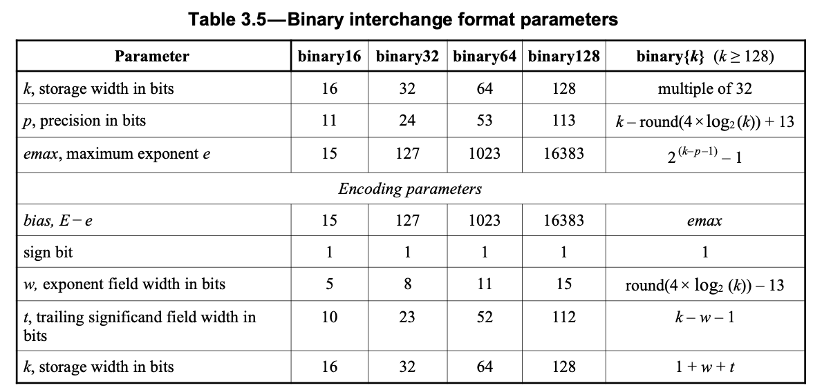
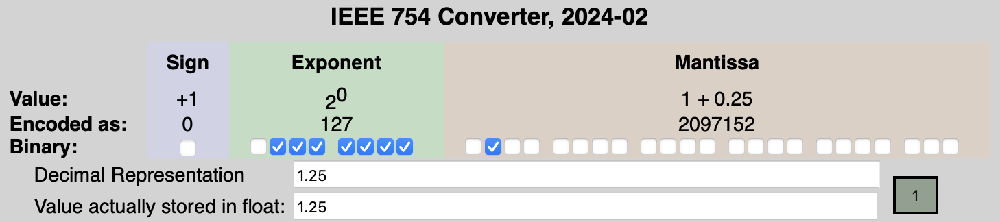
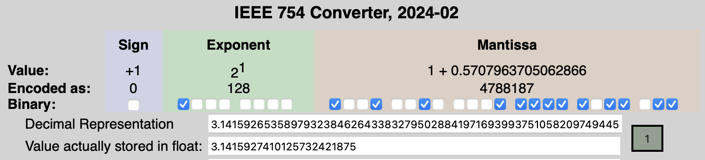
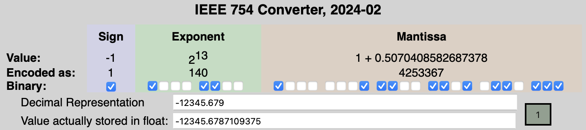

# Floating Point Numbers

Floating point numbers are such a common occurrence while programming that they're worth understanding at a fundamental level. Here I will go over what each of the bits of the float represent.

The [IEEE-754 Standard](https://www-users.cse.umn.edu/~vinals/tspot_files/phys4041/2020/IEEE%20Standard%20754-2019.pdf) defines the rules for how floating point numbers interact, but here I'd like to show some specific examples with a bit of math.
According to the standard, floats are made up of 16, 32, 64, or 128 bits.
There are a few constants defined by the standard which will come in handy later.


Here is the raw bit representation of a 32 bit float


Let's dig into what each group means!

## Sign bit

This is probably the most obvious bit. It can either be 0 representing a positive number, or a 1 representing a negative one.

## Exponent bits

From the table, these 5, 8, 11, or 15 bits (for 32, 64, 128 bit floats respectively) represent the _biased_ exponent of the float.

We can break down the biased exponent into a set of bits (e0, e1, e2, ...) and can compute the non biased value of the exponent by subtracting the bias:
```
b_exponent = e0 * 2^0 + e1 * 2^1 + ... eN * 2^N
exponent = 2 ^ (b_exp - bias)
```
where the bias from the table, is either 15, 127, 1023, or 16383 depending on your float size.

There are two special exponents:

 * All bits are 0 - this represents a _subnormal_ float, which we'll largely ignore
 * All bits are 1 - this either represents a NaN or a inf (see [Special values](#special-values))

Taking a 32 bit float for example, this gives us an approximate range of `2^(1 - 127) = 1.1754944e-38` and `2^(254 - 127) = 1.7014118e38` which is absolutely enormous! For floats that represent meters, this ranges from smaller than the planck length (`~10^-35 meters`) to much larger than the galaxy (`~10^20 meters`).

## Mantissa bits

If the exponent gives the floating point number its magnitude, the mantissa gives the float its precision. 

The remaining 10, 23, 52, 112 bits are called the mantissa. We can likewise break this down into bits (m0, m1, m2, ...) and compute the mantissa value as:

```
mantissa = 2^0 + m0 * 2^-1 + m1 * 2^-2 ... + mN * 2^-(N+1)
```

You'll notice there isn't a bit for the 2^0 term, this is intentional. For _normal_ floats, we can add on a 2^0 for free!
This win is twofold, we get some extra precision without needing the extra space and hardware implementations can specialize and assume a leading 1.
I won't cover _subnormal_ floats in this post (where there is no leading 1), but they're a special case.


For 32 bit floats, the mantissa can range between `0 + 1` to `2^-1 + 2^-2 + ... 2^-23 = 0.9999998807907104 + 1`

## Putting it all together
Mathematically we can combine our _normal_ float value to be:

```
value = sign * 2^(b_exp - bias) * mantissa
```

I'll be including screenshots for 32 bit floats from the [IEEE-754 Floating Point calculator](https://www.h-schmidt.net/FloatConverter/IEEE754.html) which is a really helpful tool to understand how they work in the wild...

### 1.25


 * sign_bit = `0` (positive)
 * exponent_bits = `2^1 + 2^2 + ... 2^6 = 127` (for an exponent value of `2^(127 - 127) = 2^0 = 1`)
 * mantissa_bits = `2^-2 = 0.25` (for an mantissa value of `1.25`)
 * value = `2^0 * (1 + 0.25) = 1.25...`

### Pi


 * sign_bit = `0` (positive)
 * exponent_bits = `2^7 = 128` (for an exponent value of `2^(128 - 127) = 2^1 = 2`)
 * mantissa_bits = `2^-1 + 2^-4 + ... + 2^-23 = 0.5707963705062866` (for an mantissa value of `1.57...`)
 * value = `2^1 * (1 + 0.57)... = 3.1415...`

### 12345.6789


 * sign_bit = `1` (negative)
 * exponent_bits = `2^2 + 2^3 + 2^7 = 140` (for an exponent value of `2^(140 - 127) = 2^13 = 8192`)
 * mantissa_bits = `2^-1 + 2^-8 + ... + 2^-23 = 0.5070408582687378` (for an mantissa value of `1.507...`)
 * value = `-2^13 * (1 + 0.507...) = 12345.6789`


## Caveats
It's very important to keep in mind that the step between floats changes exponentially. Adding 0.25 to the mantissa represents a step by 2^-127 at the lower end but 2^126 at the upper end.
This can produce odd results when doing math on floating point numbers where precision in the operation is lost.
For example, adding 1 to an enormous number (like 2^120) doesn't produce a larger number, the 1 is too small to make any difference to the larger value.

## Special values

The standard defines a couple (really a few million) special values. As I alluded to earlier, when all bits are set in the exponent, the float represents either infinity, or [NaN](https://en.wikipedia.org/wiki/NaN).
These values can be "stumbled upon" when doing math, by dividing by zero, taking the square root of a negative number, or a handful of other invalid operations.

When the exponent has all bits set but none are set in the mantissa, we have either positive or negative infinity. When _any_ bits are set in the mantissa we have a NaN value. This gives 2^24 (2^23 mantissa * 2 sign bit) total NaN values - that's a lot of nothing!
