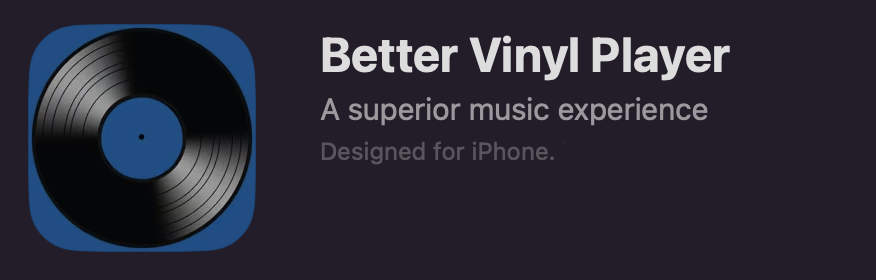

# Better Vinyl Player
_If you build it, they will come_

Last year I started getting annoyed at Spotify.
They added features left and right that felt unnecessary, they replaced a song _in place_ that I was a fan of, and it felt like I could never get it to stop playing random songs after an album ended.
I also have kind of an odd listening pattern where I tend to stick to full albums, and I really enjoy gapless playback in order make albums with tracks that blend together work.

This frustration flared up around the same time as I got into the idea of self hosting my media. The solution was easy - collect and host my own music collection!

## Backend
As I mentioned in my [backups post](../002_backups/index.md), I started using [immich](https://immich.app) to host images and I was hoping to find something similar for music. A few projects came up in my search

 * [Jellyfin](https://jellyfin.org) looked like it did a lot more than just music - a lot of things that I didn't think I'd need
 * [Plex](https://www.plex.tv) seemed more geared to video content
 * [Subsonic](https://subsonic.org/pages/index.jsp) not open source
 * [Navidrome](https://www.navidrome.org) looked just right!

Navidrome uses the [subsonic API](https://subsonic.org/pages/api.jsp) which is a pretty simple API to allow querying for albums, art, track lists, and to stream music.


Here is an exmample query for the songs in an album
```bash
$ curl http://your-server/rest/getAlbum
```

```xml
<subsonic-response status="ok" version="1.8.0">
    <album ...>
        <song id="..."/>
    </album>
</subsonic-response>

```

## Frontend
This is where the story gets interesting. I was really looking for a couple of features

 * Connect and stream music from the backend
 * Display albums and art in a simple interface
 * Support for high quality playback (my collection is in FLAC)
 * Gapless playback on my phone while it's locked

The last feature there ended up being the hardest to find.
Navidrome ships with a web frontend that doesn't support gapless playback.
I tried a handful of apps on the app store but they all didn't seem to support gapless or high quality playback! There was only one option... roll my own.

I also tried writing a small web app and did manage to get gapless playback, but Safari doesn't seem to support doing it in the background (something about power saving and javascript).

## App Development
I had been interested in finding an excuse to spin up xcode and see what the app development process looks like. 

I found it was pretty easy to make a few queries to the backend. The subsonic API mostly responds with XML so I was able to write a few parsers similar to this for the different queries I was going to do 

```swift
class AlbumListParser: NSObject, XMLParserDelegate {
...
    func parser(_ parser: XMLParser, ...) {
        if elementName == "album" {
            if let id = attributeDict["id"],
               let title = attributeDict["title"],
               let artist = attributeDict["artist"]{
                albums.append(Album(
                    id: id,
                    title: title,
                    artist: artist,
                    coverUrl: client!.getCoverArtUrl(id: id)))
            }
        }
    }
}
```

I found that xcode has some pretty cool simulator capabilities, as well as being able to actually deploy onto my phone to do testing.

After getting basic APIs up and running it was time for music.
I really wanted to focus on the gapless aspect, since that seemed like th hardest to come by.

This actually becomes a lot easier since I could assume I'd always be playing a full albums! [SwiftAudioPlayer](https://github.com/tanhakabir/SwiftAudioPlayer) did most of the heavy lifting here.
I can queue up URLs to stream, and it handles the interop with the OS

```swift
var audioPlayer = AudioPlayer()
...

for song in songs {
    urls.append(song.streamUrl)
}

DispatchQueue.main.async {
    audioPlayer.queue(urls: urls)
}
```

And that's pretty much it - I don't really know why other apps couldn't do this.

## Putting it all together
I spent a considerable amount of time working on the UI around this, with a settings page and some fancy swipe interactions. AI of course helped a lot here.

The most time around this was spent trying to get the app published - on top of $100 for a developer license, I had to add a demo mode, get screenshots at a couple different resolutions, fill out a bunch of forms... but it was worth it!


I call it [Better Vinyl Player](https://apps.apple.com/us/app/better-vinyl-player/id6737782180)


The interface is dead simple and there are only a few features - but I think they cover my needs

 * Click an album to play the album
 * Long press to start at a random point in the album
 * Gapless and background playback! All in FLAC quality.

However there are a few bugs I still need to workout

 * The app is actually called `vinyl-player` (I guess I didn't fill something in)
 * If the music is paused (by a call), you have to press play, pause, play to resume it
 * You can't resume if the music is replaced by other media


All in all, I've been using this for a majority of my music needs and it's been great! 
